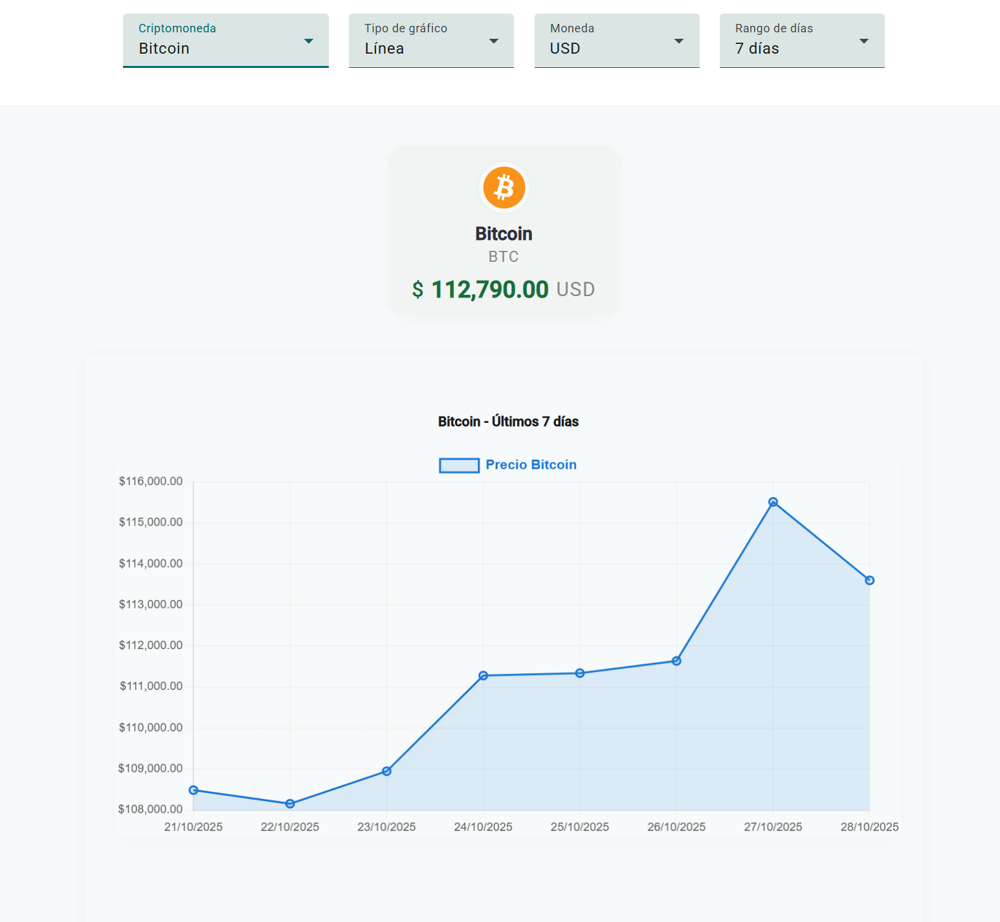
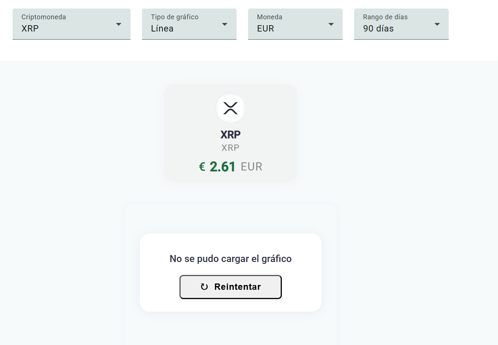

# CryptoDashboard

Dashboard interactivo que visualiza datos en tiempo real de criptomonedas usando la API pública de CoinGecko. Incluye filtros dinámicos, gráficos interactivos, diseño responsivo, manejo de errores, pruebas unitarias y enfoque en accesibilidad.

- **Stack:** Angular 16+, Angular Material, Chart.js (v4+) via ng2-charts.
- **Componentes principales:**
    - `DashboardComponent`: Muestra filtros, la tarjeta de la moneda seleccionada y el gráfico.
    - `CryptoChartComponent`: Renderiza el gráfico interactivo (línea o barras) según filtros.
    - `CryptoService`: Encapsula las llamadas a la API de CoinGecko.
- **Accesibilidad:**
    - Angular Material proporciona accesibilidad de base (tabindex, roles ARIA).
    - Se añadieron descripciones ARIA, regiones live en mensajes de carga/error y textos alternativos en imágenes.
- **Manejo de errores:**
    - Mensajes claros y botón de “Reintentar” si la API falla.
    - Spinner de carga amigable.
- **Interactividad:**
    - Filtros de criptomoneda, tipo de gráfico, moneda y rango de días.
    - Tooltips personalizadas y leyenda clara.
    - Badge de variación porcentual del precio en el periodo seleccionado.
- **Responsivo:**
    - Flexbox y media queries para adaptación total a móvil, tablet y desktop.
- **Pruebas unitarias:**
    - Incluidas para servicios y componentes clave (dashboard y gráfico).
    - Verifican renderizado, carga, error y lógica de filtrado.

---

## Instalación y ejecución

1. Clona el repositorio:
    ```bash
    git clone https://github.com/waryplumblum/crypto-dashboard.git
    cd crypto-dashboard
    ```
2. Instala dependencias:
    ```bash
    npm install
    ```
3. Inicia la aplicación localmente:
    ```bash
    ng serve -o
    ```
4. Abre [http://localhost:4200](http://localhost:4200) en tu navegador.

---

## Demo en Vivo

- [https://waryplumblum.github.io/crypto-dashboard/](https://waryplumblum.github.io/crypto-dashboard/)

---

## Deploy en GitHub Pages (Automático con GitHub Actions)

Cada vez que haces push a la rama `main`:

- GitHub Actions ejecuta las pruebas unitarias automáticamente.
- Si **todas las pruebas pasan**, se genera el build de producción y se actualiza la carpeta `/docs`.
- El contenido de `/docs` se publica automáticamente en GitHub Pages.

Tu aplicación estará disponible siempre en:

[https://waryplumblum.github.io/crypto-dashboard/](https://waryplumblum.github.io/crypto-dashboard/)

> **Nota:** Ya no es necesario ejecutar `npm run deploy-ghpages` ni subir manualmente la carpeta `/docs`. El proceso de publicación es 100% automático y seguro.

---

### Deploy manual (opcional solo para pruebas locales)

Si por alguna razón necesitas generar el build localmente:

```bash
npm run deploy-ghpages
```

Esto creará la carpeta `/docs` lista para publicar, pero **no es necesario subirla manualmente** si estás usando el flujo automático.

---

## Capturas de Pantalla

- **Carga inicial:**  
  
- **Dashboard con datos:**  
  
- **Modo móvil:**  
  
- **Mensaje de error:**  
  

---

## Estructura

```
src/
  components/
    dashboard-component/
    crypto-chart-component/
  services/
    crypto-service.ts
  app.routes.ts
  app.module.ts
  ...
```

---

## Problemas conocidos

- Si la API pública de CoinGecko está caída, no es posible mostrar datos hasta que vuelva a estar disponible.
- Cambios en la estructura de la API podrían requerir pequeños ajustes en el servicio.
- El gráfico es informativo, no apto para trading profesional.

---

## Testing

Este proyecto incluye pruebas unitarias para los componentes y servicios principales.

Para correr los tests, usa:

```bash
ng test
```

- Las pruebas usan **Brave** como navegador automatizado (puedes cambiar a Chrome si lo prefieres).
- Puedes ver/cubrir los tests en los archivos `*.spec.ts` de cada componente o servicio.

#### Ejemplo de salida con todos los tests exitosos:

```
18 specs, 0 failures, randomized with seed 41602
CryptoChartComponent
  should show spinner when loading is true
  should render chart when not loading and no error
  should show error message and retry button when error is set
  should call fetchChart on retry click
  should set aria-label with coinName
  should handle service error and show error message
  should create
  should update chart data when fetchChart is called
CryptoService
  should be created
  should fetch markets with correct params
  should fetch coin market chart with correct params
DashboardComponent
  should show spinner when loading is true
  should load cryptos from service on init
  should handle API error
  should show selection message when no crypto is selected
  should call onSelectCrypto when crypto changes
  should create
App
  should create the app
```

Puedes ver/cubrir los tests en los archivos `*.spec.ts` de cada componente o servicio.

## Compatibilidad

- Probado en:
    - Brave
    - Microsoft Edge

---

## Mejoras futuras

- [🚧] Exportar gráfico como imagen.
- [🚧] Selector multimoneda para comparar varias criptos.
- [✔] Tema oscuro/claro.
- [🚧] Internacionalización (i18n).

---

## Autor

- [Eduardo Hernández García](https://github.com/waryplumblum) – Frontend Engineer

---